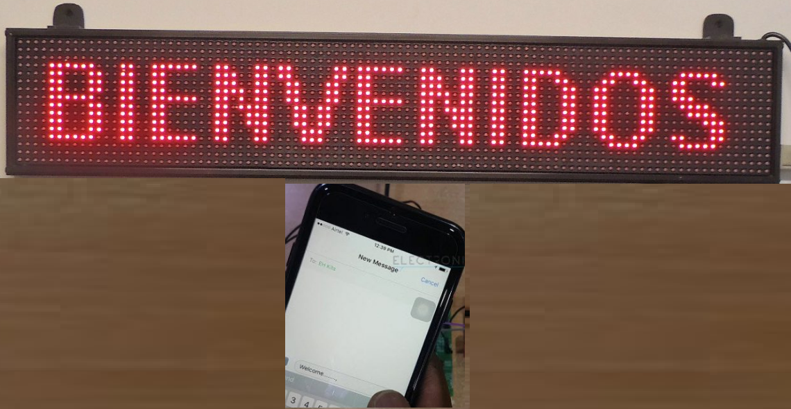

# Tablero electrónico de avisos inalámbrico

Este tablero electrónico inalámbrico se usa para mostrar datos enviados desde un teléfono celular a una pantalla LCD.

Hoy en día conocemos la importancia de los tableros de anuncios en lugares públicos como estaciones de ferrocarril, de autobuses y en aeropuertos. Con la implementación de este proyecto la tarea de cambiar dichos avisos se vuelve más sencilla al usar un dispositivo móvil. 

Abad Chávez Carlos Alberto
